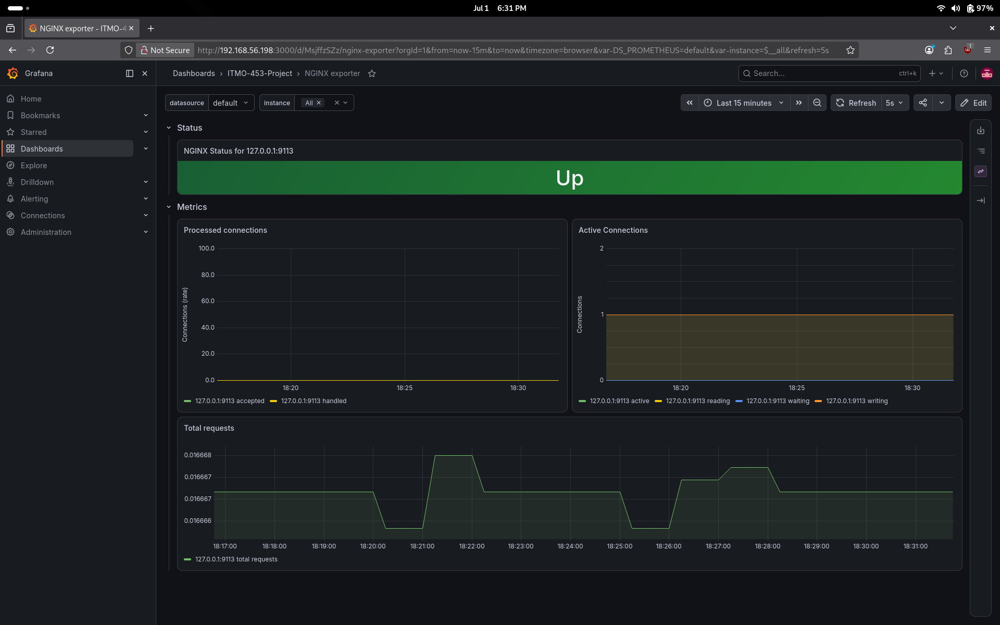
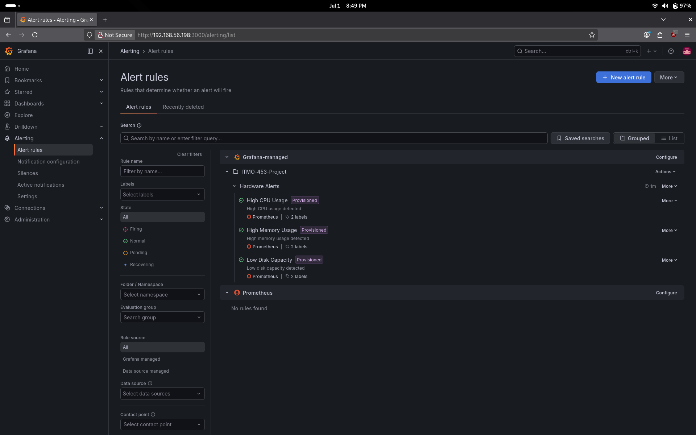
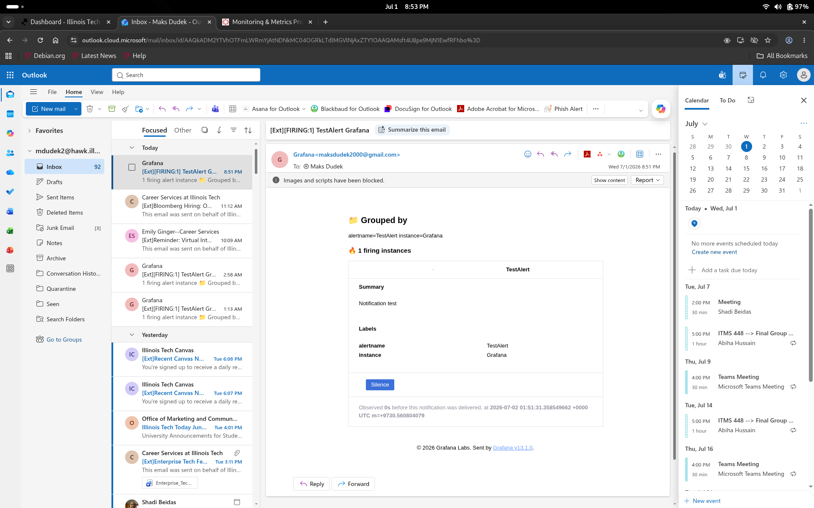

# Operational Report

This system is managed and configured completely via code and represents a simple example of infrastructure as code. All administrative tasks are performed via either bash scripting or through the use of YAML configuration files. This allows any administrator the ability to automate the majority of work that is needed to be done to both setup and maintain the system. Monitoring is built in which allows for real time collection and analysis of metrics. This allows for administrators to always know the status of the system and take action if a failure or an ineffeciency presents itself.

A typical workflow for an administrator on this system would be to log into the Grafana webapp and monitor the system through one of the two included dashboards. From that point on the administrator could analyze trends such as typical CPU usage, average memory usage, The amount of traffic that is present on the website at any point in time, etc. These types of metrics can then be used to make administrative decisions.

For example, the administrator could note that there has been an increase in traffic to the webserver over the last couple of days and then take a look at system resource usage. If usage is significantly higher than the administrator could take action to fix this via provisioning more resources to the system by either allocating more to that system, or by implementing load balancing with multiple webservers instead.

Major configuration changes are performed via ansible. This is a crucial aspect of configuring and working on this system. Ansible provides an easy way to store important configuration and also ensure that each step of configuring the server was performed correctly. It also helps with organizing and auditing changes that are made to the system so that there is never any doubt as to how the system is configured. 

## Monitoring Platform

The monitoring platform of choice for this system is Grafana with prometheus as a data source. These two services are available locally on the system via web access through any browser. This allows for real time monitoring of the system at any time and allows for any issues to be quickly identified and resolved quickly if they should arise.

## Metrics Dashboards

This system makes use of two premade grafana dashboards which were designed to monitor node-exporter and nginx-exporter. These dashboards provide visualization for basically any relevant metric that is exposed by these two exporters.

### Nginx Exporter Dashboard

### Node Exporter Dashboard

### Alerts

This system is configured to provide administrators with email alerts via Grafana. Currently there are three alerts configured: An alert for high CPU usage, an alert for high memory usage, and an alert for low disk space on the system. These alerts can provide administrators with real time warnings of issues that the system is facing. For example, if the administrator receives an alert about high CPU or memory usage then the administrator can immediately take an action to remedy the issue such as inspecting the most resource intensive processes and making sure that they are not hanging or freezing.

### Alert Dashboard

### Test Alert Demonstration

